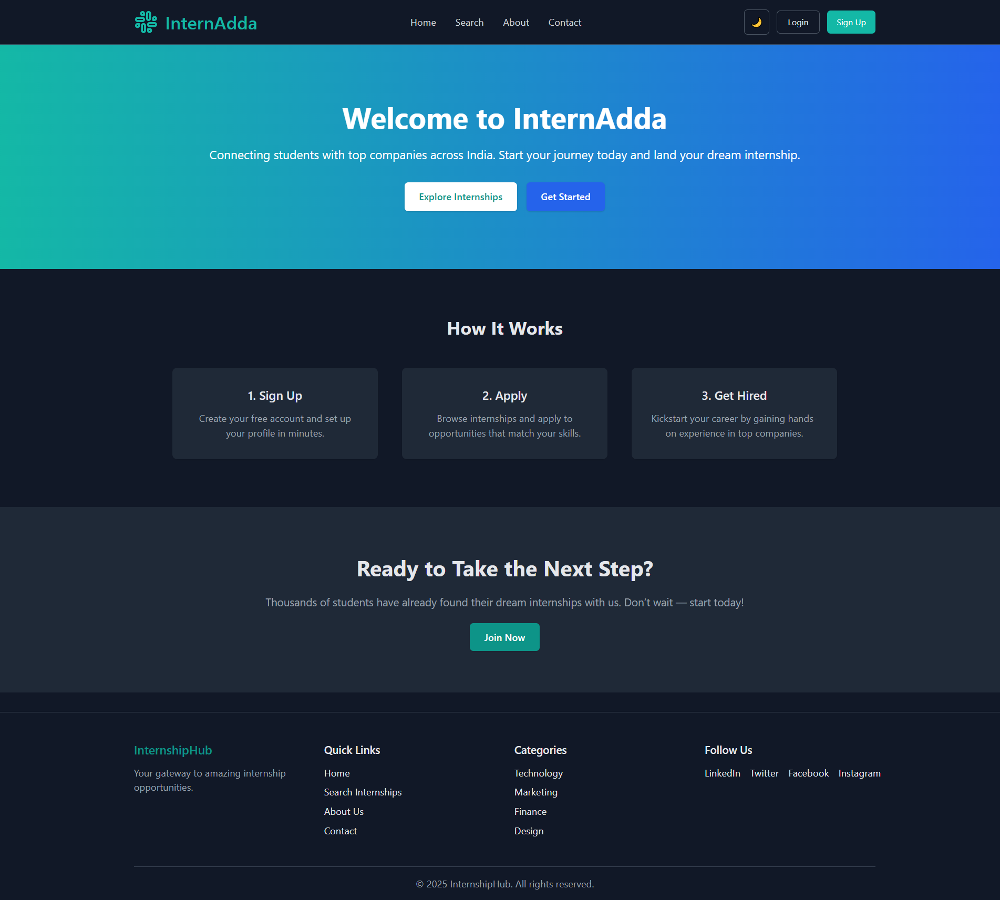

# InternAdda – Frontend



## Overview
InternAdda is a web platform that helps students discover and apply for internships while allowing admins to manage listings efficiently.

This repository contains the **frontend** built using React.

## Features
- Browse internships
- Apply and save internships
- Admin dashboard for managing listings
- Add/Edit internship forms (with sector & skills support)
- Image preview + auto-fetch support
- Responsive UI (dark/light mode)

## Tech Stack
- React.js
- Tailwind CSS
- Axios
- React Router

---

## Setup Instructions

1. **Clone the repo**
   ```bash
   git clone https://github.com/devvrat-singh-gth/internshipHub-frontend
   cd internshipHub-frontend
2. **Install Dependencies**
   ```bash
   npm install
4. **Run local server**
   ```bash
   npm run dev
